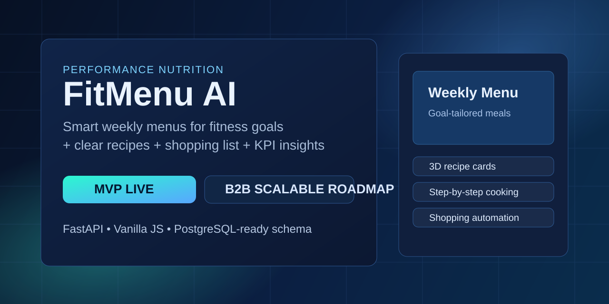
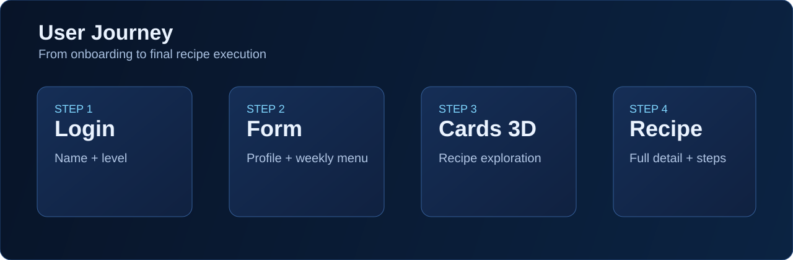
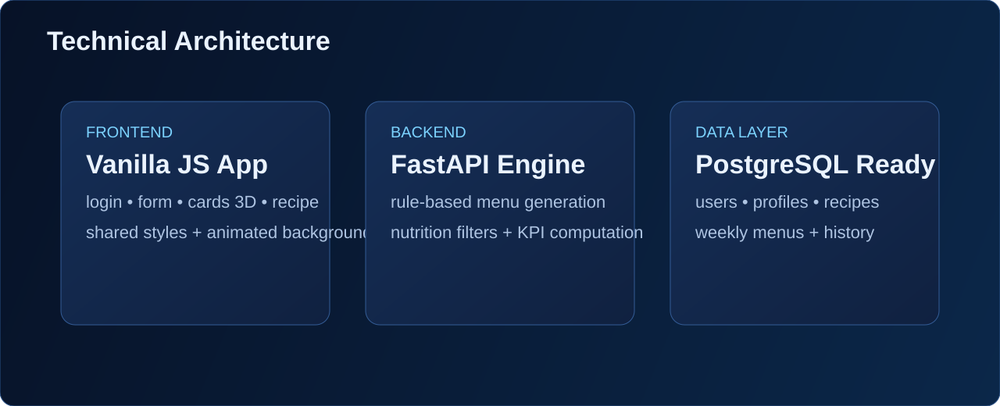

# FitMenu AI Studio

<p align="center">
  <strong>AI Nutrition Platform for Fitness & Wellness</strong><br/>
  Menus semanales inteligentes, recetas paso a paso y experiencia visual premium para entornos B2B.
</p>

<p align="center">
  <a href="./README.en.md">English Version</a>
</p>

<p align="center">
  
  
  
  
</p>



## 0. Vista visual
### Flujo de producto


### Arquitectura


## 1. Vision del proyecto
**FitMenu AI Studio** es una plataforma de nutricion inteligente orientada a rendimiento deportivo, bienestar y adherencia alimentaria.

El objetivo es evolucionar desde un **MVP funcional** a un **SaaS B2B escalable**, preparado para gimnasios, empresas wellness, coaches y plataformas de salud digital.

## 2. Problema que resuelve
Personas que entrenan o quieren cuidarse suelen bloquearse por:
- falta de planificacion semanal realista,
- recetas poco claras o poco sostenibles,
- dificultad para adaptar dieta a objetivos y restricciones,
- baja adherencia por friccion diaria.

## 3. Solucion propuesta
FitMenu AI convierte datos de perfil en decisiones utiles:
- menu semanal personalizado por objetivo,
- recetas saludables con instrucciones paso a paso,
- informacion nutricional (kcal, proteina, carbohidratos, grasa),
- lista de compra agregada,
- experiencia UI moderna para aumentar engagement.

## 4. Valor para empresas (B2B)
- Personalizacion a escala sin aumentar coste operativo.
- Mayor retencion y adherencia de usuarios finales.
- Base para integraciones white-label.
- Estructura preparada para evolucion multi-tenant.

## 5. Estado actual
**En desarrollo activo.**

Actualmente el proyecto incluye:
- backend operativo con motor de reglas,
- frontend multipagina navegable,
- flujo completo desde login hasta receta,
- base documental tecnica y de producto.

## 6. Flujo funcional de la aplicacion
1. `login.html`  
   Captura nombre y nivel de usuario (`Bajo`, `Intermedio`, `Avanzado`).
2. `form.html`  
   Configuracion del perfil nutricional y generacion del menu semanal.
3. `recipes.html`  
   Exploracion visual en cartas 3D de recetas.
4. `recipe.html`  
   Vista completa de receta seleccionada y preparacion.

## 7. Arquitectura tecnica
```text
Frontend (HTML/CSS/JS multipagina)
        |
        v
Backend API (FastAPI + reglas nutricionales)
        |
        v
Data Model SQL (base para PostgreSQL en produccion)
```

### Stack
- **Frontend:** HTML5, CSS3, JavaScript (Vanilla).
- **Backend:** Python, FastAPI, Pydantic.
- **Persistencia (diseno):** PostgreSQL (`db/schema.sql`).
- **Documentacion API:** OpenAPI/Swagger.

## 8. Motor nutricional (backend)
La API procesa:
- sexo (`male`, `female`),
- edad, peso, altura,
- objetivo (`lose_fat`, `maintain`, `gain_muscle`),
- tipo de dieta (`omnivore`, `vegetarian`, `vegan`),
- restricciones (`lactose_free`, `gluten_free`),
- alergias,
- comidas por dia.

### Pipeline de decision
1. Estimacion calorica por perfil.
2. Filtrado de recetas compatibles.
3. Seleccion por tipo de comida (desayuno/comida/cena/snacks).
4. Construccion de plan semanal de 7 dias.
5. Calculo de KPIs y lista de compra consolidada (endpoint full).

## 9. Endpoints principales
| Metodo | Endpoint | Uso |
|---|---|---|
| `GET` | `/health` | Estado de servicio |
| `POST` | `/menus/weekly` | Menu semanal resumido |
| `POST` | `/menus/weekly/full` | Menu completo + KPIs + shopping list |
| `GET` | `/recipes` | Catalogo de recetas |
| `GET` | `/recipes/{recipe_id}` | Receta individual |

## 10. Esquema de datos (SQL)
Entidades actuales:
- `users`
- `user_profiles`
- `recipes`
- `weekly_menus`

Rol funcional:
- `users`: identidad.
- `user_profiles`: preferencias y restricciones.
- `recipes`: datos nutricionales + ingredientes + pasos.
- `weekly_menus`: planes semanales persistidos.

Referencia: `db/schema.sql`

## 11. Estructura del repositorio
```text
backend/     # API FastAPI y motor de recomendacion
frontend/    # UI multipagina + animaciones + navegacion
db/          # schema SQL
docs/        # producto, arquitectura, roadmap y demo API
```

## 12. Ejecucion local
### Backend
```bash
cd backend
python -m venv .venv
# Windows
.venv\Scripts\activate
pip install -r requirements.txt
uvicorn app.main:app --reload --port 8001
```
Swagger:
- `http://127.0.0.1:8001/docs`

### Frontend
```bash
cd frontend
python -m http.server 5500
```
Abrir:
- `http://127.0.0.1:5500/login.html`

## 13. Roadmap de escalado
### Fase 1 (actual)
- MVP end-to-end funcional.
- Menus + recetas + lista de compra.
- UX orientada a demo comercial.

### Fase 2
- Persistencia completa real en PostgreSQL.
- Autenticacion robusta y gestion de cuentas.
- Feedback loop para recomendaciones adaptativas.
- Reglas nutricionales mas finas por sexo/objetivo/contexto.

### Fase 3
- SaaS B2B multi-tenant.
- Panel admin para empresas.
- Analitica de adherencia y rendimiento.
- Integraciones con apps fitness/wearables/partners.

## 14. Nota profesional
Este sistema es una plataforma tecnologica de apoyo nutricional.  
No reemplaza evaluacion medica o nutricional profesional.

## 15. Autor
**Viorel Gil Ruiz**  
Proyecto en construccion continua con foco en calidad tecnica, producto y escalabilidad.
