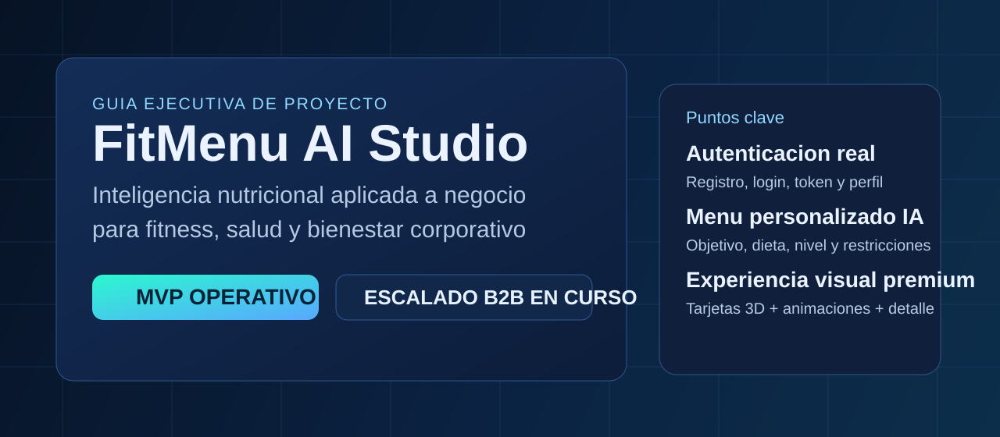
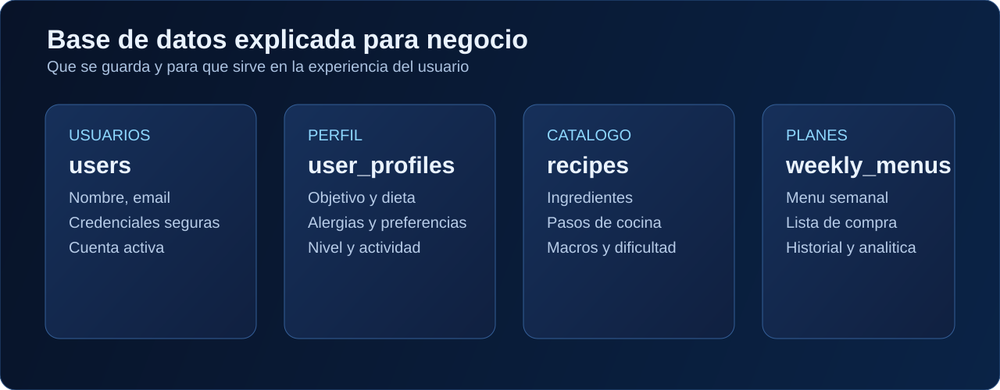

# 📘 Guía de Usuario para Empresas: FitMenu AI Studio

## 👋 Introducción
Este documento está diseñado para una persona **sin conocimientos de programación**.

Su objetivo es explicar, de forma clara y visual:
- qué es FitMenu AI Studio,
- qué problema de negocio resuelve,
- cómo funciona paso a paso,
- qué tecnologías se han utilizado,
- cuál es el estado actual del proyecto,
- cómo puede escalarse a un producto comercial.

## 🧭 Resumen ejecutivo
**FitMenu AI Studio** es una aplicación de nutrición inteligente que genera menús semanales personalizados según el perfil de cada persona.

La plataforma combina:
- formulario inteligente,
- generación automática de menú,
- recetas paso a paso,
- lista de compra,
- interfaz visual moderna con tarjetas 3D.

### 🎯 ¿Para quién está pensado?
- Gimnasios y cadenas fitness.
- Empresas con programas de bienestar corporativo.
- Clínicas, nutricionistas y coaches.
- Apps de salud que quieran integrar nutrición personalizada.

## ❗ Problema que resuelve
En entornos de salud y fitness hay un problema repetido:
- la mayoría de usuarios no sabe qué cocinar,
- les cuesta mantener constancia,
- no adaptan la alimentación a su objetivo real,
- acaban abandonando por fricción.

FitMenu AI reduce esa fricción con una experiencia guiada y personalizada.

## ✅ Solución propuesta
La aplicación transforma datos de usuario en recomendaciones prácticas:
- menú semanal ajustado a objetivo y restricciones,
- recetas claras (ingredientes + pasos),
- dificultad según el nivel del usuario,
- recomendaciones de IA al terminar el formulario.

## 🧩 Cómo funciona la aplicación (sin tecnicismos)

### 1) Pantalla de acceso
El usuario puede:
- iniciar sesión si ya tiene cuenta,
- registrarse si es su primera vez.

El sistema guarda su información básica y su configuración de uso.

### 2) Formulario inteligente
Una vez dentro, el usuario completa su perfil:
- edad, peso, altura, sexo,
- objetivo (perder grasa, mantener, ganar músculo),
- tipo de dieta,
- alergias y alimentos que no le gustan,
- actividad y tiempo disponible para cocinar.

Si el usuario ya había usado la app, el formulario se autocompleta.

### 3) Consejo IA
Al enviar el formulario, la app muestra un resumen comprensible:
- cómo es el perfil del usuario,
- qué recomendaciones son más adecuadas,
- por qué el menú propuesto encaja con su caso.

### 4) Menú semanal
Se generan automáticamente comidas para los 7 días, ajustadas al perfil.

### 5) Recetas y detalle
Cada comida permite abrir su receta con:
- foto,
- datos nutricionales,
- ingredientes,
- preparación paso a paso.

## 🖼️ Flujo visual del producto

## 🏗️ Arquitectura explicada de forma simple
La solución se divide en 3 capas:
- **Frontend**: lo que ve y usa el usuario en pantalla.
- **Backend**: el motor que decide menús y gestiona autenticación.
- **Datos**: la estructura donde se guarda información de usuarios, perfiles y planes.

## 🗃️ Base de datos explicada para negocio

### Qué guarda cada bloque
- **users**: datos de cuenta (quién es el usuario).
- **user_profiles**: datos de nutrición y estilo de vida.
- **recipes**: catálogo de recetas, nutrientes y pasos.
- **weekly_menus**: menús generados e historial.

## 🔐 Seguridad y sesión (estado actual)
- Registro e inicio de sesión con backend.
- Contraseñas protegidas con hashing seguro.
- Sesión con token Bearer y expiración.
- Guardado de preferencias y perfil de forma persistente.

## 🧪 Qué está implementado hoy
- ✅ Login/Registro completo con backend.
- ✅ Formulario avanzado con autocompletado.
- ✅ Motor de menú personalizado.
- ✅ Catálogo ampliado de recetas (r1-r22).
- ✅ Tarjetas 3D y animaciones visuales.
- ✅ Recomendación IA de perfil tras el formulario.

## 🧠 Personalización real del menú
La recomendación considera:
- objetivo nutricional,
- dieta y restricciones,
- alergias,
- ingredientes no deseados,
- nivel culinario,
- actividad física,
- días de entrenamiento,
- tiempo máximo de preparación,
- preferencia de coste.

## 📊 Valor comercial para una empresa
### Beneficios directos
- Mejora de adherencia del usuario final.
- Mayor percepción de valor del servicio.
- Menor trabajo manual para crear planes.
- Base para vender planes premium o soluciones white-label.

### KPI sugeridos para negocio
- % usuarios que completan menú semanal.
- % recetas abiertas/ejecutadas.
- Retención semanal y mensual.
- NPS o satisfacción del plan generado.

## 🛠️ Tecnologías utilizadas
Aunque el documento es no técnico, este resumen ayuda a validar robustez:
- **Frontend**: HTML, CSS, JavaScript.
- **Backend**: Python + FastAPI.
- **Modelo de datos**: esquema SQL preparado para PostgreSQL.
- **API**: endpoints para autenticación, usuario y menú.

## 🗺️ Cómo se ha construido el proyecto paso a paso
1. Diseño de la idea de producto y propuesta de valor.
2. Definición de arquitectura y esquema de datos.
3. Implementación del backend de menús y recetas.
4. Construcción de interfaz multipágina.
5. Mejora visual (fondo animado, tarjetas 3D, interacción).
6. Autenticación completa con registro/login y token.
7. Sincronización de perfil de usuario y autocompletado.
8. Documentación comercial y técnica para presentación empresarial.

## 🚀 Estado del desarrollo y próximos pasos
### Estado actual
Proyecto en fase **MVP avanzado funcional**.

### Próximas mejoras prioritarias
- Migración de persistencia de demo a base de datos productiva.
- Panel de administración para empresas (B2B).
- Métricas de uso y reporting.
- Integraciones con apps fitness/wearables.
- Publicación cloud con entorno staging/producción.

## 🧾 Conclusión
FitMenu AI Studio ya demuestra un caso sólido de producto:
- problema real,
- solución clara,
- experiencia moderna,
- base técnica escalable,
- potencial comercial B2B.

Para una empresa, esto significa una oportunidad concreta de ofrecer nutrición personalizada con más valor y menos fricción operativa.

---

**Autor del proyecto**: Viorel Gil Ruiz  
**Documento**: Guía empresarial no técnica  
**Última actualización**: 16 de febrero de 2026
